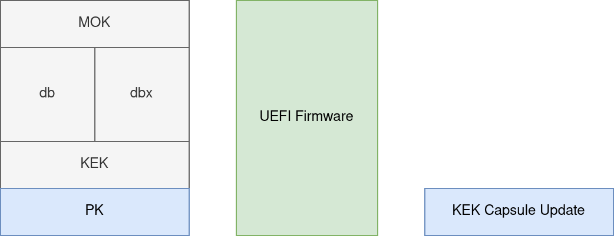
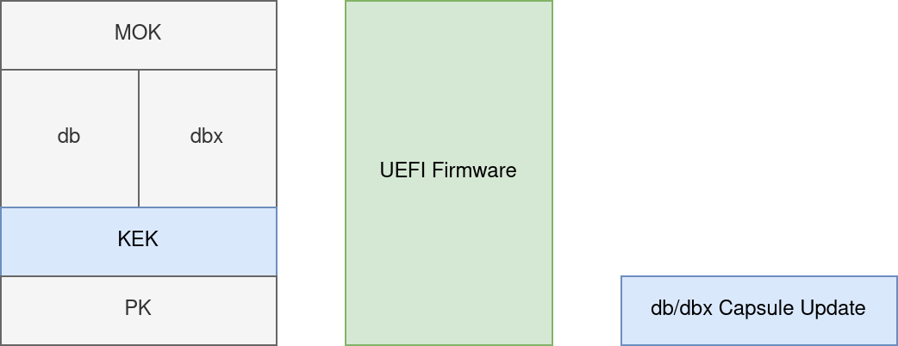
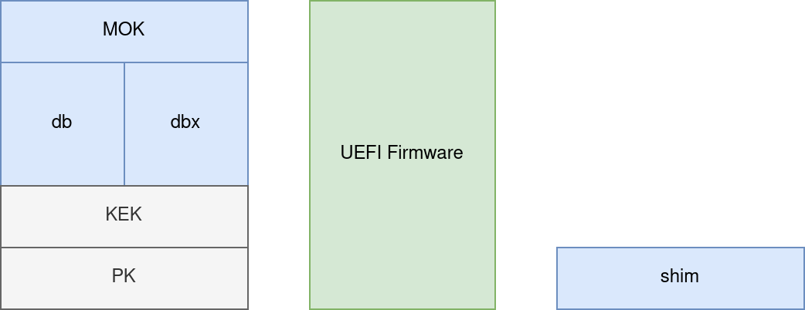
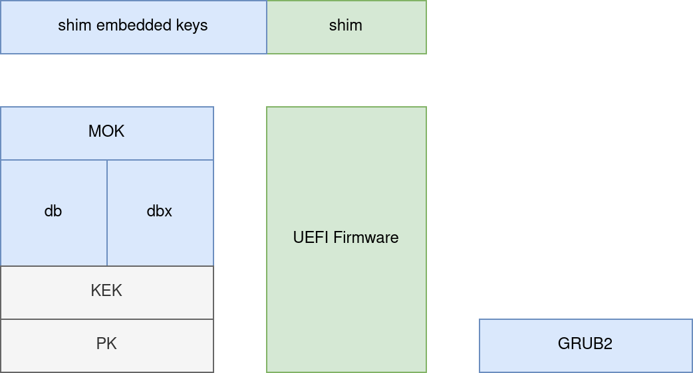
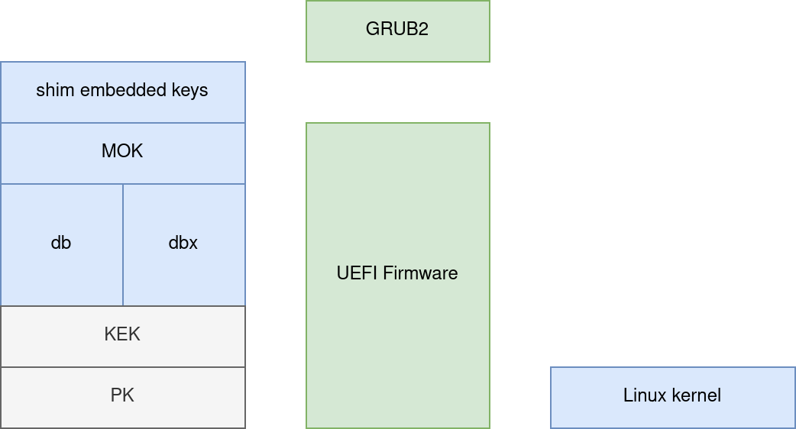
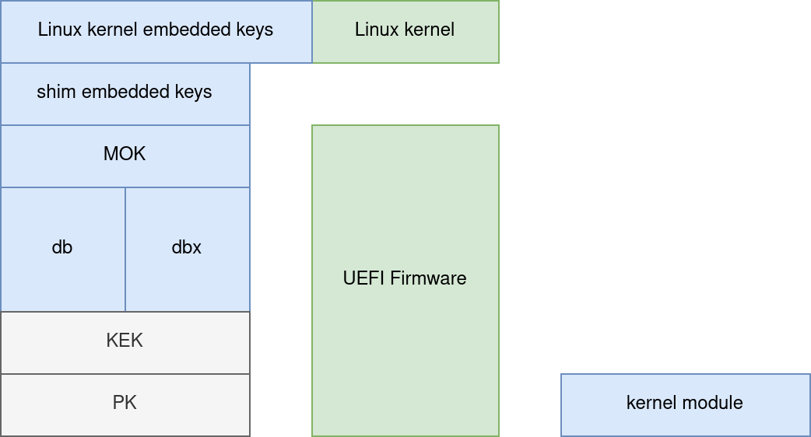

# Secure Boot keys

## Purpose

This repo contains diagrams that I use when discussing Secure
Boot keys and their purpose.

I've illustrated:

 * the use of the PK, during KEK updates
 * the use of the KEK, during DB/DBX updates
 * the use of the DB/DBX and MOK, during the normal boot sequence

## What is Secure Boot?

Simply put, Secure Boot is an implementation of code signing, usable
in the firmware boot environment. In the commercial software world, it
is common for software developers to sign their code. Secure
production networks can deploy policies that allow only signed code to
run. Using an allow-list of signing certificates is highly effective
as an anti-malware mechanism. Secure Boot brings that practice to
consumer devices to prevent malware in a device's privileged execution
mode.

## KEK updates

The Platform Key (PK) is the trust root for a system. It is typically
a key owned by the device manufacturer. If the system boots and finds
a capsule update for the Key Exchange Key (KEK), the update must be
signed by the PK. If the KEK update has a valid signature from the PK,
then the system will update its KEK.

  
   

## DB/DBX updates

The Key Exchange Key (KEK) serves a similar purpose, but is typically
a key managed by an OS vendor like Microsoft. The KEK is used to
authorize updates to the allowed signature database (db) and revoked
signature database (dbx). If the system boots and finds a capsule
update for the db/dbx, the update must be signed by the KEK.

  
   

## Booting a Linux operating system with shim and GRUB2

When a PC boots, the firmware will use the UEFI Boot Manager to select
an executable program to run. For many GNU/Linux systems, this will be
"shim". The Boot Manager will provide the location of a file, and the
firmware will validate the signature of that file against the dbx, the
db, and the MOK. If the file is disallowed by the dbx, then it will
not execute. If it is allowed by the db or the MOK, then the firmware
will begin executing the code in that file.

  
   

shim embeds signing keys of its own in its executable file. When it
runs, those keys can be used to verify code that is loaded later on.
shim is designed to be as small as possible so that it needs to be
signed by a db key infrequently, while allowing the distribution
vendor to sign and update a more complete boot loader as often as
necessary.

Like the firmware, shim will locate a file containing GRUB2. It will
verify that GRUB2 has a valid signature, and that the key that signed
GRUB2 is not in the dbx, and that it is in the db, or the MOK, or in
the keys that were embedded in shim when it was compiled.

  
   

GRUB2 continues this process. It loads its configuration files in
order to locate a kernel and initramfs. Similar to earlier stages,
GRUB2 will verify that the kernel has a valid signature, that the key
that signed the kernel is not in the dbx, and that it is in the db, or
the MOK, or in the keys that were embedded in shim.

  
   

Finally, if the kernel enforces module signing (which is typical on a
Secure Boot system), then it will perform a similar process. Like
shim, the kernel embeds additional keys, including keys that were
generated when the kernel was compiled, used to sign its set of kernel
modules, and then discarded. When it loads a kernel module, it will
verify that the module has a valid signature, that the key that signed
the module is not in the dbx, and that it is in the db, or the MOK, or
the keys that were embedded in shim, or in the keys that were embedded
in the kernel image.

  
   

## References

1. https://docs.redhat.com/en/documentation/red_hat_enterprise_linux/10/html/managing_monitoring_and_updating_the_kernel/signing-a-kernel-and-modules-for-secure-boot
2. https://access.redhat.com/articles/5254641
3. https://learn.microsoft.com/en-us/windows-hardware/manufacture/desktop/windows-secure-boot-key-creation-and-management-guidance?view=windows-11
